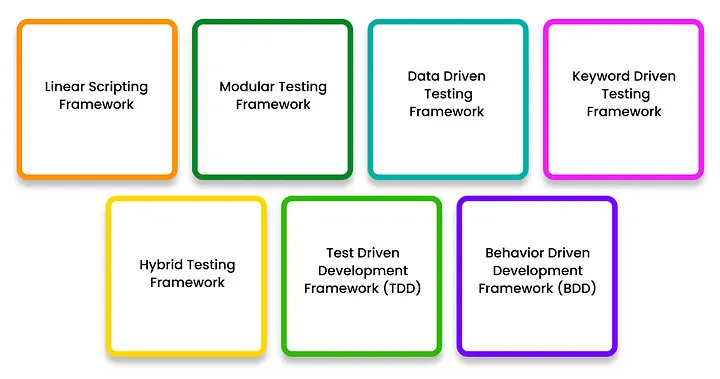

# 一些日常笔记：

### 1、移动端

#### 移动端-CPU\GPU\内存、流量、电量、启动和切换响应时间、渲染帧率\刷新率Fps、数据缓存（修改、类似）压力/负载-特定区域流量、最大连接数/storage、反复大get请求、大文件下载、反复大post写入；响应时间、硬件限制（CPU\RAM\IO)、吞吐量TPS、打开数据库连接、第三方内容

#### 全覆盖、兼容、网络、升级、权限过期

adb shell dumpsys connectivity // 查看连接情况
adb shell dumpsys package com.yude.jieyao
adb shell am start com.viide.repair/.MainActivity filter eafbc70
adb shell am start  com.android.settings/com.android.settings.Settings
adb pull /data/data/... C:\Users\EDY\Desktop
adb shell pm list packages -3

#### 自动化

设置WiFi
adb shell

### 2、接口自动化框架

#### rest-assured+allure+testNg，requests+pytest+allure（采用），postman+Newman

数据驱动（高级参数化区别）、关键字驱动（动作级）、page object model、Python-重构自动化-数据驱动

pipline-拉代码、本地搭环境、本地运行服务、启动脚本代码、保存报告、mock服务

   
测试服务器（本地、线上）；   

自动化测试服务器、性能测试服务器；

代码上线流程工具（上传Git、打包编译、sonar、smoke、发布stage测试环境）；

### 3、其他

#### 项目管理

工作规范文档化，流程化   

#### 质量认证体系
[CMMI(初始级、已管理级、已定义级、量化管理级、优化级)](https://cmmiinstitute.com/pars/?StateId=caf45928-cb61-4547-ac60-4b028a2712c7)      
[SEI美国软件工程学会(software engineering institue,简称SEI)](https://www.sei.cmu.edu/about/index.cfm)   
[ISO20000信息技术服务管理体系\ISO27001信息安全管理体系\ISO9001质量管理体系](https://www.cqc.com.cn/www/chinese/txrz/)       
1、ISO 9001：ISO 9001是一项国际标准，用于质量管理体系。它为组织提供了建立和维护质量管理体系的指南，包括软件开发组织。通过实施ISO 9001，组织可以确保其软件开发过程符合国际认可的质量标准。
   
2、CMMI（Capability Maturity Model Integration）：CMMI是一种过程改进方法，旨在评估和改进组织的软件开发过程。它定义了一系列成熟度级别和关联的过程领域，帮助组织了解其软件开发能力，并提供改进路径。CMMI的级别包括初始级别、被管理级别、定义级别、量化管理级别和优化级别。
   
3、IEEE 730：IEEE 730是软件质量保证计划的标准，它描述了在软件开发生命周期中执行的质量保证活动。该标准包括质量目标、质量保证活动、质量标准和审查过程等方面。
   
4、IEEE 829：IEEE 829是软件测试文档的标准，定义了软件测试过程中的各种文档类型和内容。这些文档包括测试计划、测试设计规范、测试用例、缺陷报告等，有助于确保测试过程的可追溯性和一致性。
   
5、Six Sigma：Six Sigma是一种质量管理方法，旨在减少产品或过程的缺陷率。它基于数据驱动的方法，使用统计工具和质量技术来分析和改进过程。通过应用Six Sigma，组织可以降低软件开发过程中的缺陷率，提高产品质量。
#### 合约

NFT智能合约特性，remix，B-智能合约测试-solidity测试框架；nodejs本地搭链，发布合约

#### 线上服务监控

### 混沌测试

### 4、一些工具

[plantUML](https://plantuml.com/zh/starting)（时序图、用例图、类图、组件图、部署图、状态图、框架图、甘特图……）
[docker](https://www.coonote.com/docker/docker-common-commands.html)——搭建服务和测试运行环境    

selenium（后端）/cypress(前端)   
gradle
testNG   

### 5、经验累积

1. UI自动化
   规范类：对齐、大小写、标点符号、中英文字体等；
   提示类：错误提示
   输入类：正常值、边界值、错误值、null、不输入、异常类型、sql语句
   #### 框架：
   Selenium：Selenium是最受欢迎的UI自动化测试框架之一，支持多种编程语言，如Java、Python和C#。它可以模拟用户在网页上的操作，执行各种测试任务。   
   Appium：Appium是一个开源的UI自动化测试框架，专门用于移动应用程序的测试。它支持多种移动平台，如iOS和Android，并提供跨平台的测试能力。   
   Cypress：Cypress是一个现代化的JavaScript前端测试框架，旨在对Web应用程序进行端到端的自动化测试。它具有简单易用的API和强大的调试功能。   
   TestComplete：TestComplete是一款功能强大的UI自动化测试工具，支持多种应用程序类型，包括Web、桌面和移动应用程序。它提供了丰富的测试功能和易于使用的脚本记录功能。   
   [Maestro](https://maestro.mobile.dev/)：

3. 接口自动化
   数据驱动&过程驱动
   接口自动化筛选标准   
   接口请求耗时：不保持连接>保持连接，requests=httpx(同步模式)>httpx(异步模式)>aiohttp   
4. 精准测试
5. 单元测试
   Junit、TestNG、
6. TDD（测试驱动开发）
7. BDD（行为驱动开发）：契约测试
8. DevOPS
9. POM(page object model)

####
