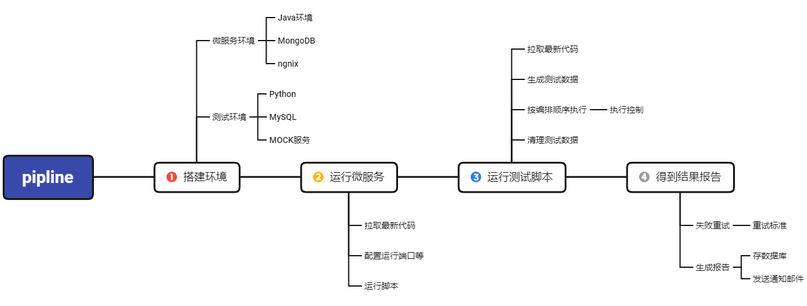

# 一些日常笔记：

### 1、移动端

#### 移动端-CPU\GPU\内存、流量、电量、启动和切换响应时间、渲染帧率\刷新率Fps、数据缓存（修改、类似）压力/负载-特定区域流量、最大连接数/storage、反复大get请求、大文件下载、反复大post写入；响应时间、硬件限制（CPU\RAM\IO)、吞吐量TPS、打开数据库连接、第三方内容

#### 全覆盖、兼容、网络、升级、权限过期

adb shell dumpsys connectivity // 查看连接情况
adb shell dumpsys package com.yude.jieyao
adb shell am start com.viide.repair/.MainActivity filter eafbc70
adb shell am start  com.android.settings/com.android.settings.Settings
adb pull /data/data/... C:\Users\EDY\Desktop
adb shell pm list packages -3
#### 自动化

设置WiFi
adb shell

### 2、接口自动化框架

#### rest-assured+allure+testNg，requests+pytest+allure（采用），postman+Newman

pipline-拉代码、本地搭环境、本地运行服务、启动脚本代码、保存报告、mock服务

Python-重构自动化-数据驱动

### 3、其他

#### 项目管理

工作规范文档化，流程化

#### 合约

NFT智能合约特性，remix，B-智能合约测试-solidity测试框架；nodejs本地搭链，发布合约

#### 线上服务监控

### 混沌测试

### 4、一些工具

[plantUML](https://plantuml.com/zh/starting)（时序图、用例图、类图、组件图、部署图、状态图、框架图、甘特图……）
[docker](https://www.coonote.com/docker/docker-common-commands.html)

### 5、经验累积

1. UI自动化
   先编写基本对齐、大小写、标点符号等规范；
2. 接口自动化
   数据驱动&过程驱动
3. 单元测试
4. TDD
5. DevOPS

####
